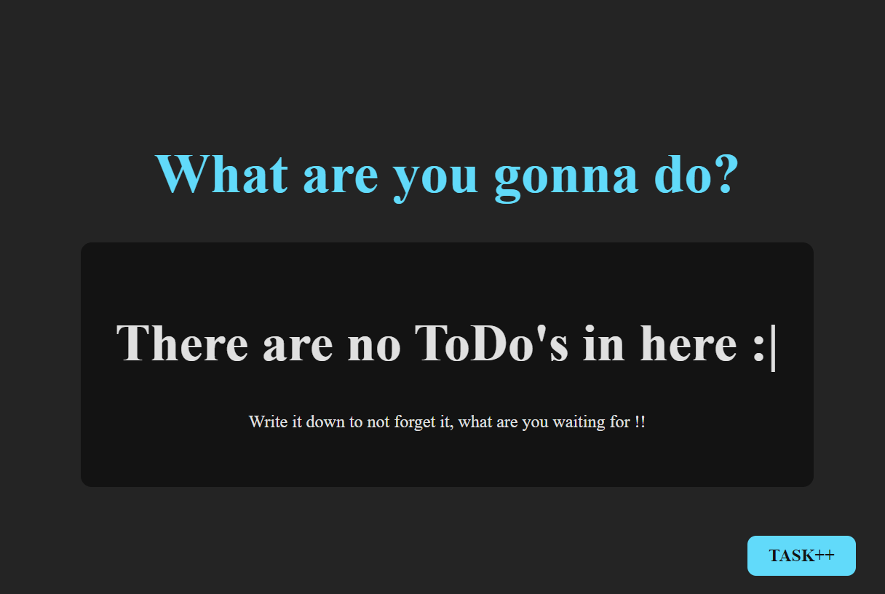
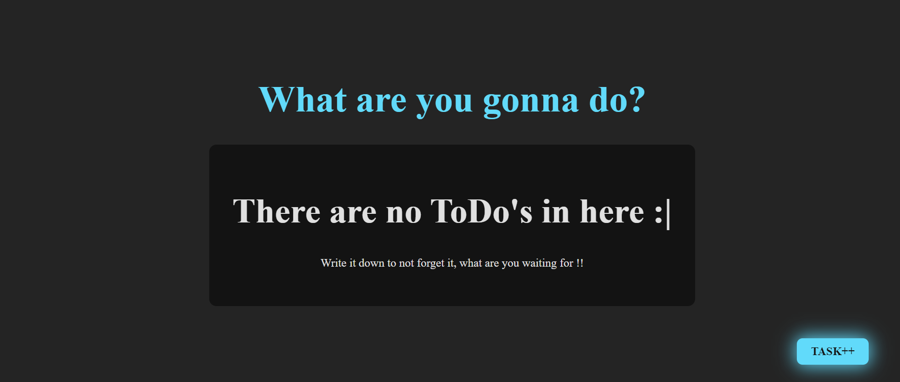
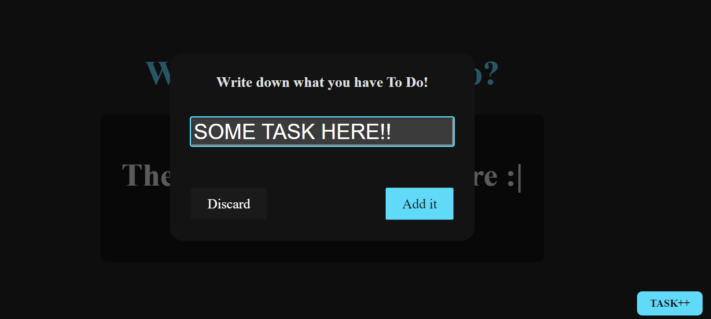
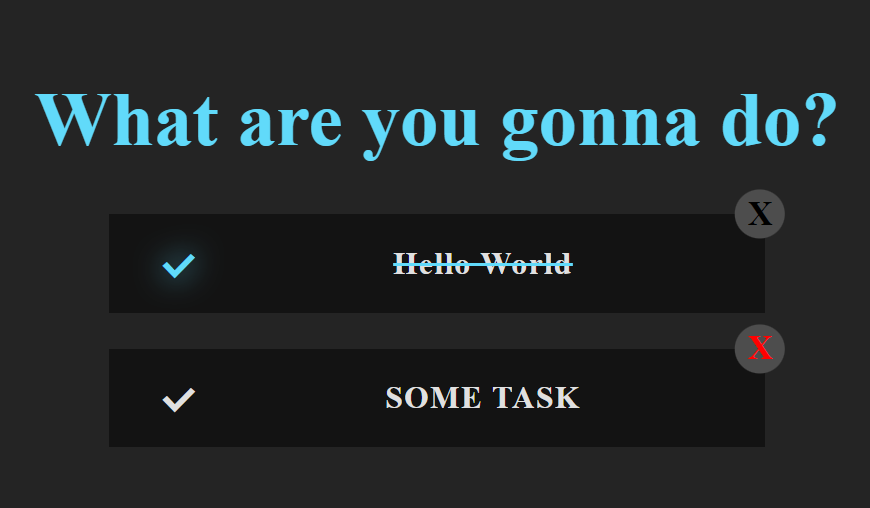

## A SIMPLE TO DO LIST Work In Progress

**AS I LOST ALL MY OLD PROJECTS AND FILES I WORKED IN THE PAST :( I'M WORKING ON THEM RIGHT NOW :D :)

* At least now i have more experience with react and i learned git and github in the meantime

MAIN PAGE

CLICKING TASK:

TASK CREATED: 

